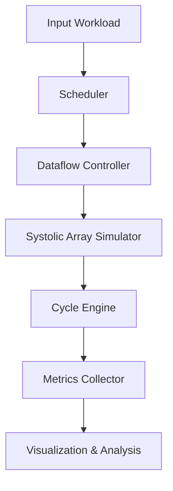

# SystolicAI


**SystolicAI** is a configurable AI accelerator simulator that models the execution of neural network workloads on a systolic-array-based architecture, similar to modern AI accelerators such as Google TPU architectures.

This project was built for educational, research, and hardware exploration purposes, allowing users to experiment with different accelerator configurations and analyze architectural tradeoffs in AI hardware systems.

## 🎯 Overview

Modern AI workloads rely heavily on matrix multiplication and convolution operations. Traditional CPUs are inefficient for these workloads due to limited parallelism and memory bottlenecks. Dedicated AI accelerators solve this using systolic arrays, parallel MAC units, optimized dataflow, and local memory reuse.

SystolicAI aims to simulate these architectural principles in software. Instead of running computations directly on CPU/GPU APIs, SystolicAI models:
- Compute pipelines
- Systolic data propagation
- Execution latency
- Hardware utilization
- Memory bandwidth effects

## ✨ Key Features

1. **Processing Element (PE)**: Cycle-accurate MAC operations, local accumulation, activation/weight loading, and horizontal/vertical data forwarding.
2. **Multiple Dataflow Architectures**:
   - **Output Stationary (OS)**: Accumulates partial sums locally in PE registers.
   - **Weight Stationary (WS)**: Pre-loads and pins weights in PEs; streams partial sums down columns.
   - **Row Stationary (RS)**: Pre-loads and pins activations in PEs; streams partial sums horizontally across rows.
3. **Systolic Array Grid**: Configurable PE grids (e.g., 2x2, 4x4, 8x8) supporting synchronized data propagation.
4. **CNN Convolution Workloads**: Native 2D Convolution layers simulated on the systolic array by mapping them to GEMM via `im2col` lowering and `col2im` output reconstruction.
5. **Matrix Multiplication Engine**: Tiled execution and skewing schedulers supporting arbitrary matrix dimensions.
6. **Cycle-Accurate Simulation**: Advances one clock cycle at a time, tracking PE grid activity, power state, and compute latency.
7. **Performance Metrics**: Reports total cycles, throughput (MACs/cycle), and spatial PE utilization.
8. **Simulated Quantization (INT8)**: Models 8-bit integer operations on hardware, clipping inputs/registers to 8-bit range `[-128, 127]` and partial sum accumulators to 32-bit integer range `[-2^31, 2^31 - 1]`.
9. **Sparsity-driven Acceleration**: Supports Unstructured and 2:4 Structured zero-skipping logic to optimize cycle counts and report dynamic power savings.
10. **Transformer Attention Kernels**: Lowers and schedules sequential Multi-Head Self-Attention layers onto the systolic array.
11. **Visualization Dashboard**: Streamlit-based interactive web dashboard with config controls for array size, dataflow, precision, sparsity, workload parameters, correctness verification alerts, and cycle-by-cycle activity heatmaps.

## 🏗️ System Architecture



### Internal Modules
- `pe.py`: Processing Element logic
- `array.py`: Systolic array management
- `simulator.py`: Cycle execution engine
- `metrics.py`: Performance analysis
- `visualize.py`: Heatmaps and graphs
- `workloads.py`: Matrix workloads

## 🚀 Setup & Installation

1. Clone the repository and navigate to the project directory.
2. Create and activate a Python virtual environment:
   ```bash
   python3 -m venv venv
   source venv/bin/activate
   ```
3. Install the required dependencies:
   ```bash
   pip install -r requirements.txt
   ```

## 💻 Usage

Run the provided matrix multiplication example script to simulate execution, calculate metrics, and generate visualizations.

```bash
python examples/run_matmul.py
```

**Example Output Metrics:**
```
Array Size: 4x4
Matrix Size: 8x8 * 8x8
Total MACs: 512
Total Cycles: 60
PE Utilization (%): 53.33
Throughput (MACs/cycle): 8.53
```

This script will automatically create an `assets/` folder containing performance plots and heatmaps.

## 🧪 Testing

The simulator is verified against standard NumPy operations. Run the test suite using `pytest`:

```bash
pytest tests/
```

## 🗺️ Roadmap

- **Phase 1 (Completed):** Basic systolic simulator, output stationary matmul, metrics, and visualization.
- **Phase 2 (Completed):** CNN convolution support, multiple dataflows (Weight Stationary, Row Stationary), correctness verification alerts, Streamlit UI controls.
- **Phase 3 (Completed):** Sparse matrix acceleration, quantization support, transformer attention kernels.
- **Phase 4 (Completed):** RTL backend, FPGA mapping, RISC-V custom instruction integration.
